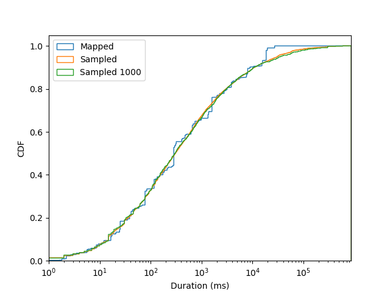
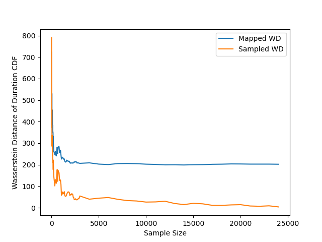
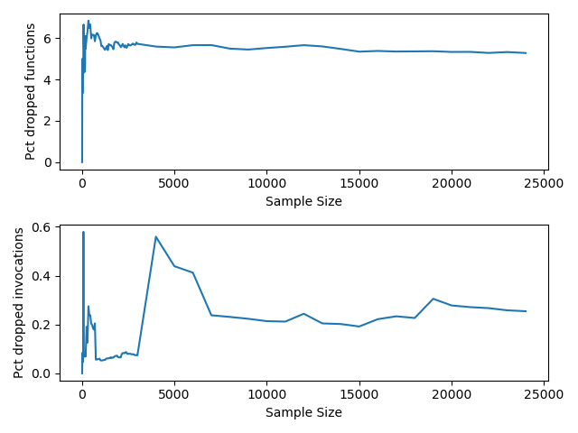

# Mapper

Use the mapper tool to map functions in a specific trace directory (with memory and duration traces) to proxy functions in the [`vSwarm`](https://github.com/vhive-serverless/vSwarm/tree/main/) benchmark suite. The benchmarks in the vSwarm suite have been profiled, and their memory utilization and duration traces are stored in the `profile.json` file. The tool maps each function in the trace to its closest proxy in the benchmark suite based on memory and duration correlation.

The [`profiler` tool](https://github.com/vhive-serverless/vSwarm/tree/load-generator/tools/profiler#profiler) generates the `profile.json` JSON output file to profile the benchmark suite functions. We provide the `profile.json` file as a compressed file in the `tools/mapper` directory.

### Usage

```bash
usage: mapper.py [-h] -t TRACE_DIRECTORYPATH -p PROFILE_FILEPATH

Arguments:
    -h, --help            show this help message and exit
    -t TRACE_DIRECTORYPATH, --trace-directorypath TRACE_DIRECTORYPATH
                                                Path to the directory containing the trace files (required)
    -p PROFILE_FILEPATH, --profile-filepath PROFILE_FILEPATH
                                                Path to the profile file containing the proxy functions
```

The tool reads trace information (memory and duration details) from the `trace/` directory, configurable using `-t` or `--trace-directorypath` flags. The `trace/` directory must contain `memory.csv` and `durations.csv` files with trace information in the format mentioned in the [*Azure Functions Dataset 2019*](https://github.com/Azure/AzurePublicDataset/blob/master/AzureFunctionsDataset2019.md).

#### Function Execution Duration `durations.csv` Schema

|Field|Description  |
|--|--|
| HashOwner | unique id of the application owner |
| HashApp | unique id for application name  |
| HashFunction | unique id for the function name within the app | 
|Average | Average execution time (ms) across all invocations of the 24-period|  
|Count | Number of executions used in computing the average|  
|Minimum | Minimum execution time|  
|Maximum | Maximum execution time|  
|percentile_Average_0| Weighted 0th-percentile of the execution time *average*|  
|percentile_Average_1| Weighted 1st-percentile of the execution time *average*|  
|percentile_Average_25 | Weighted 25th-percentile of the execution time *average*|  
|percentile_Average_50 | Weighted 50th-percentile of the execution time *average*|  
|percentile_Average_75 | Weighted 75th-percentile of the execution time *average*|  
|percentile_Average_99 | Weighted 99th-percentile of the execution time *average*|  
|percentile_Average_100 | Weighted 100th-percentile of the execution time *average*|
Execution time is in milliseconds. 

#### Function Memory Usage `memory.csv` Schema

|Field|Description  |
|--|--|
| HashOwner | unique id of the application owner |
| HashApp | unique id for application name  |
| HashFunction | unique id for the function name within the app |
|SampleCount | Number of samples used for computing the average |  
|AverageAllocatedMb | Average allocated memory across all SampleCount measurements|  
|AverageAllocatedMb_pct1 | 1st percentile of the average allocated memory|  
|AverageAllocatedMb_pct5 | 5th percentile of the average allocated memory|  
|AverageAllocatedMb_pct25 | 25th percentile of the average allocated memory|  
|AverageAllocatedMb_pct50 | 50th percentile of the average allocated memory|  
|AverageAllocatedMb_pct75 | 75th percentile of the average allocated memory|  
|AverageAllocatedMb_pct95 | 95th percentile of the average allocated memory|  
|AverageAllocatedMb_pct99 | 99th percentile of the average allocated memory|  
|AverageAllocatedMb_pct100 | 100th percentile of the average allocated memory|

Use the [`sampler`](https://github.com/vhive-serverless/invitro/tree/main/sampler) tool in InVitro to generate sampled traces from the original Azure traces.

For every function in the trace, the tool sets the closest function in the [`vSwarm`](https://github.com/vhive-serverless/vSwarm/tree/main/) benchmark suite as its proxy (considering 50-percentile memory and 50-percentile duration for the highest correlation). The 50th percentile ensures that the mapping corresponds not only to the peak values of the workload but also to a representative proxy function. Currently, the tool uses only _Serving Functions_ that are _NOT Pipelined_ as proxy functions.

vSwarm currently *does not* fully cover the Azure trace functions. To avoid high error in function mapping, we set a hard threshold of 40% as the maximum absolute error (from the actual trace function duration) that a proxy function can have to be mapped to a trace function. If no eligible function is found for mapping from vSwarm, we use standard InVitro trace functions for those functions alone.

The mapper requires the profiles of the vSwarm benchmark functions to identify proxies. The tool uses the `profile.json` JSON output file generated by the [`profiler` tool](https://github.com/vhive-serverless/vSwarm/tree/load-generator/tools/profiler#profiler) to obtain the profile of the benchmark suite functions. We provide a profile file in the `tools/mapper` directory as a compressed file and once decompressed, this is used as the default profile. Users can configure the path of the profile file to be used through the `-p` (or `--profile-filepath`) flag.

An example of a generated output file is as follows:

```json
{
        "c13acdc7567b225971cef2416a3a2b03c8a4d8d154df48afe75834e2f5c59ddf": {
                "proxy-function": "video-processing-python-10"
        },
        "a2faad786b3c813b12ce57d349d5e62f6d0f22ceecfa86cd72a962853383b600": {
                "proxy-function": "image-rotate-go-11"
        },
        "7dc5aeabc131669912e8c793c8925cc9928321f45f13a4af031592b4611630d7": {
                "proxy-function": "video-processing-python-70"
        },
        "ae8a1640fa932024f59b38a0b001808b5c64612bd60c6f3eb80ba9461ba2d091": {
                "proxy-function": "video-processing-python-20"
        }
}
```

The mapper stores the output file in the trace directory with the name `mapper_output.json` by default. The output file contains the mapping of the trace functions to the proxy functions in the vSwarm benchmark suite.

### vSwarm statistics

The vSwarm benchmark suite has been profiled, and the statistics of the functions are stored in the `profile.json` file. The statistics include the memory and duration details of the functions **(as profiled on two Intel Xeon Silver 4114 10-core CPUs at 2.20 GHz with 192GB of DDR4 RAM)**. The table below gives an overview of broad statistics of the functions in the vSwarm benchmark suite.

| Metric | Value |
| --- | --- |
| Minimum Duration (ms) | 0.7466532679738556 ms |
| Maximum Duration (ms) | 27459.274496825394 ms |
| Average Duration (ms) | 2612.325542552247 ms |
| Minimum Memory (MB) | 24.235294117647058 MB |
| Maximum Memory (MB) | 1293.3715789473683 MB |
| Average Memory (MB) | 142.66478734351986 MB |

### Error metrics and mapping accuracy 

We evaluated the accuracy and effectiveness of the mapper tool using the following metrics:

- Duration CDF plot of the trace functions and the generated mapping
- Wasserstein distance (WD) plot between the trace functions and the mapped functions

As mentioned previously, the maximum function duration achievable with vSwarm functions is near 27 seconds. For the WD plot, we exclude trace functions beyond this duration to better compare the mapping accuracy.

The CDF plot of the trace functions and the mapped functions is as follows:



As shown, the mapping is quite accurate for the majority of the functions. The WD plot is as follows:



The dropped functions plot is shown below:



Additionally, we display the following error metrics whenever the mapper runs with a trace (the specified values below are results for the full Azure trace mapping):

| Metric | Value |
| --- | --- |
| Average memory error | -7.638341413565764 MB per invocation |
| Average duration error | 4174.5554028958695 ms per invocation |
| Average absolute memory error | 24.24782794856284 MB per invocation |
| Average absolute duration error | 4414.451828203135 ms per invocation |
| Average relative memory error | -0.8412999109296387 |
| Average relative duration error | 0.004934168605729668 |
| Average absolute relative memory error | 1.0028566557523266 |
| Average absolute relative duration error | 0.20141343497568448 |
| Functions with 0 duration | 1596 |
| Number of mapped functions with higher than 40% duration error (replaced by InVitro trace functions) | 5258 |

---