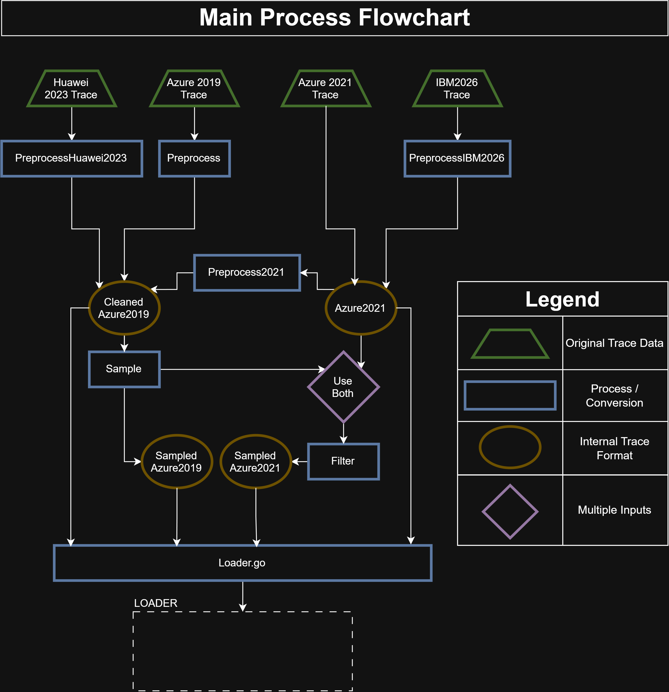
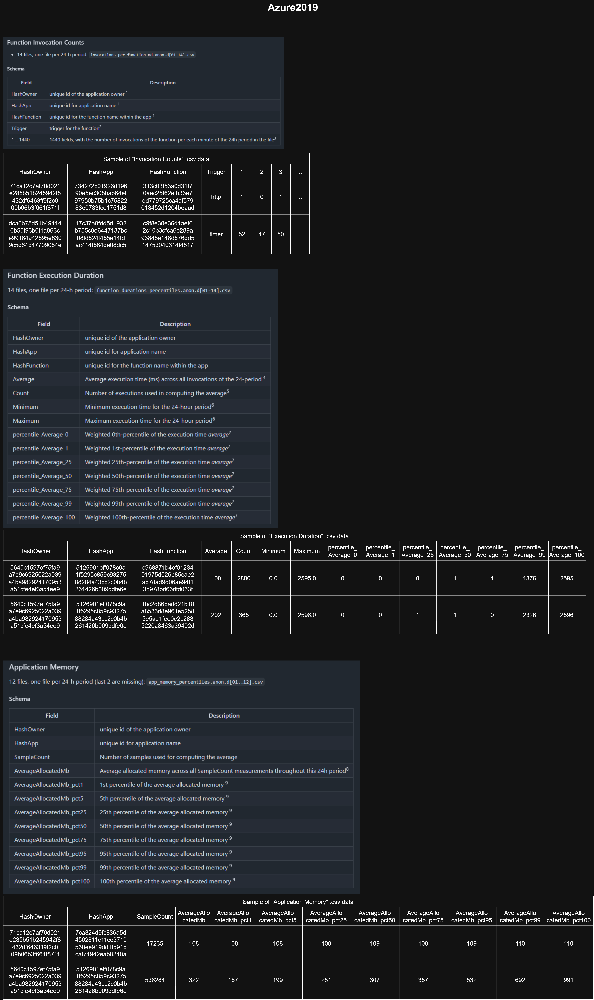
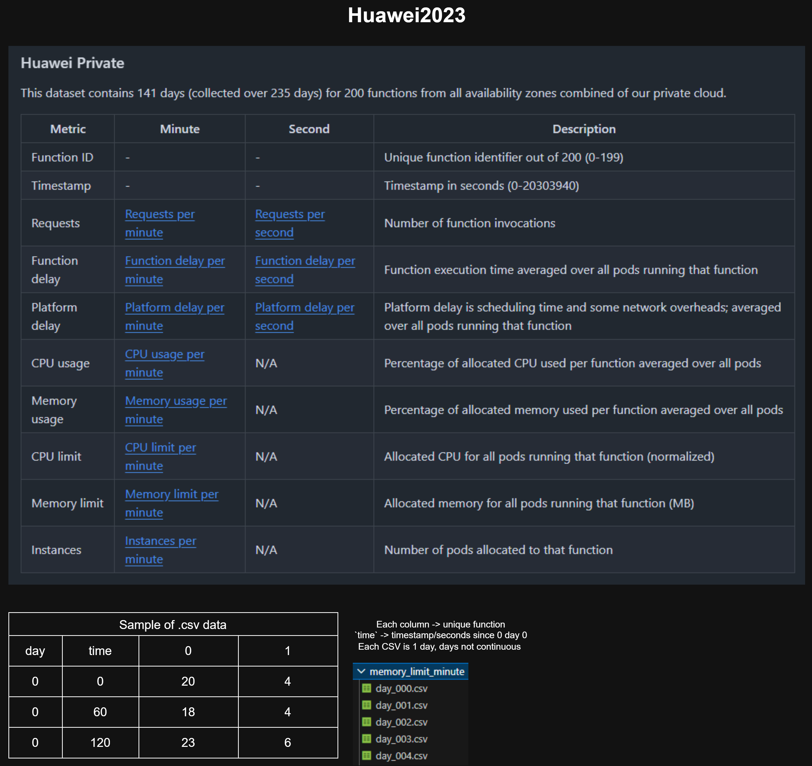
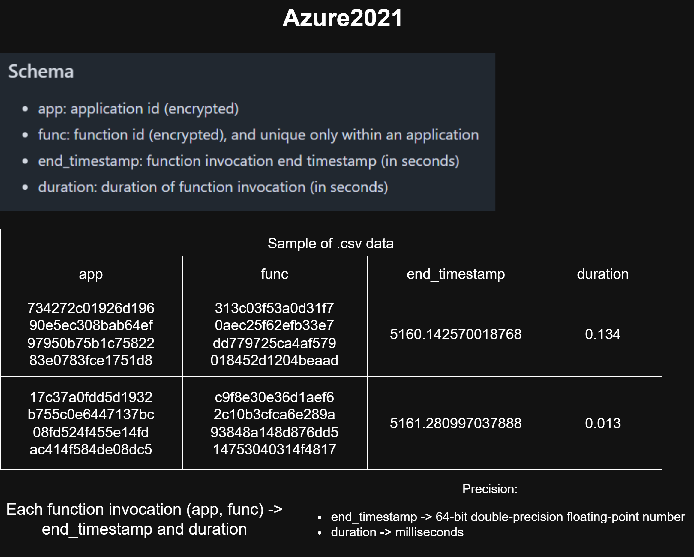
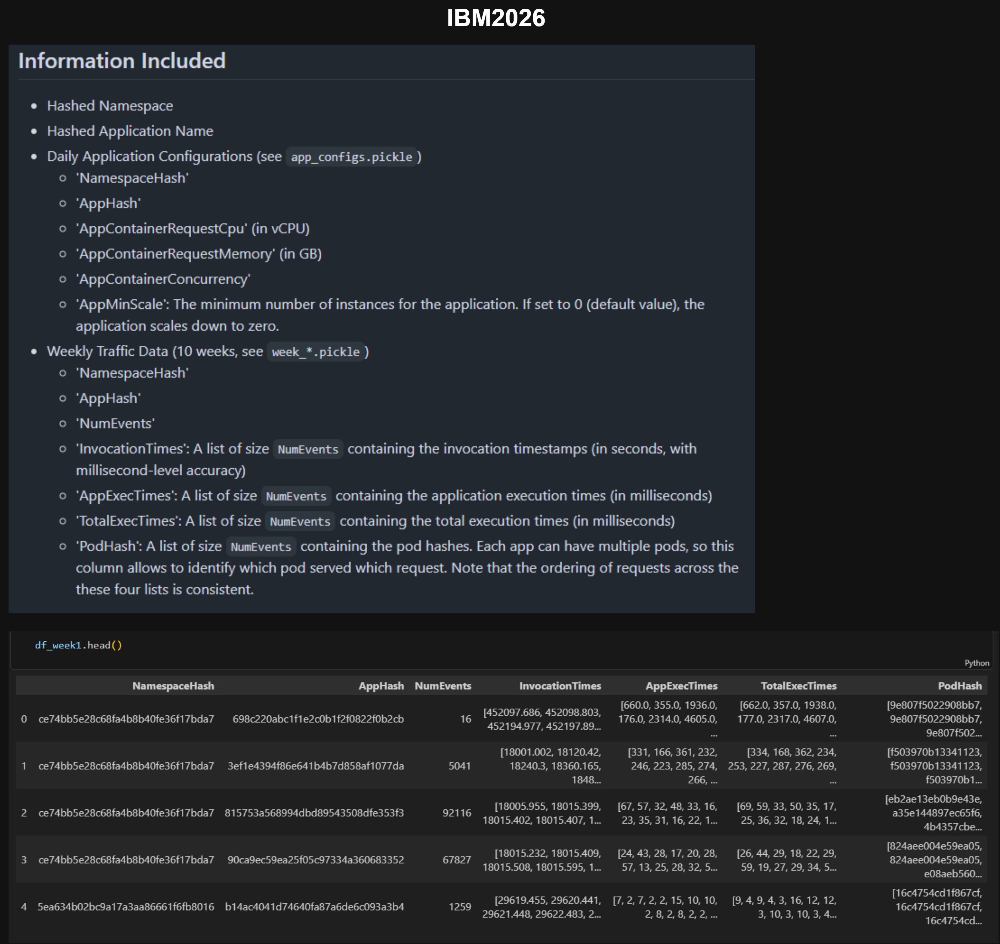

## Context
This document serves to explain how different trace types are organised and used within InVitro.

While this document aims to be as complete as possible, the most up-to-date information should be referenced from the direct documentation files (`loader.md` and `sampler.md`) or read from source directly.

Current documentation includes:
- This markdown document
- Diagrams 
  - Made using [draw.io](https://www.drawio.com/)
  - Located [here](./figures/)
  - Diagram -> View image file directly
  - Draw.io file -> Reopened in the [draw.io browser](https://app.diagrams.net/)

## Internal Structure 
### Structure
Internally, traces have 2 main formats.
- `Cleaned_Azure2019` (per-function aggregated percentile statistics)
- `Azure2021` (per-invocation data)

Trace support
- Loader and Sampler only directly support the 2 main formats.
- Support for all other formats are achieved by transforming them into either of the 2 main formats.

### Loader
| Trace Type        | Support Implemented By          |
| :---------------- | :-------------------------------|
| Cleaned_Azure2019 | Directly supported              |
| Azure2021         | Directly supported              |
| Azure2019         | Convert to `Cleaned_Azure2019`  |
| Huawei2023        | Convert to `Cleaned_Azure2019`  |
| IBM2026           | Convert to `Azure2021`          |

### Sampler
| Trace Type        | Support Implemented By                                                 |
| :---------------- | :----------------------------------------------------------------------|
| Cleaned_Azure2019 | Directly supported                                                     |
| Azure2021         | Convert to `Cleaned_Azure2019`, sampled, converted back to `Azure2021` |
| Azure2019         | Convert to `Cleaned_Azure2019`                                         |
| Huawei2023        | Convert to `Cleaned_Azure2019`                                         |
| IBM2026           | Convert to `Azure2021`                                                 |

### Summary flowchart
The flowchart below summarises how each input trace is converted into internal formats, before finally being used in Loader.

## Trace Schema
### Simplified Schema
A simplified overview of the different trace types is shown below 

| Trace Type | Specificity | Invocation | Duration | Memory |
| :---: | :---: | :---: | :---: | :---: |
| Azure2019 | Per-function   | Count (at each minute) | Percentiles of average execution time        | Percentiles of average allocated memory |
| Huawei2023| Per-function   | Count (at each second) | Avg function execution time (at each minute) | Average usage over all pods (at each minute) |
| Azure2021 | Per-invocation | Timestamp              | Seconds                                      | N/A {Empirical 200MB chosen} |
| IBM2026   | Per-invocation | Timestamp              | Milliseconds                                 | N/A {Empirical 200MB chosen} |

### Detailed Trace Schema
A more detailed schema diagram for each trace type can be found in the table below. It includes the original repo that each trace was sourced from.

| Trace Type        | Detailed Schema Diagram Link              | Original Repo                              |
| :---------------- | :-----------------------------------------| :-----------------------------------------|
| Cleaned_Azure2019 | [Link](./figures/Cleaned_Azure2019.png) | - |
| Azure2021         | [Link](./figures/Azure2021.png)         | [Azure Functions Trace 2019](https://github.com/Azure/AzurePublicDataset/blob/master/AzureFunctionsInvocationTrace2021.md) |
| Azure2019         | [Link](./figures/Azure2019.png)         | [Azure Functions Invocation Trace 2021](https://github.com/Azure/AzurePublicDataset/blob/master/AzureFunctionsDataset2019.md) |
| Huawei2023        | [Link](./figures/Huawei2023.png)        | [Huawei Public Cloud and Huawei Private Cloud data release 2023](https://github.com/sir-lab/data-release/blob/main/README_data_release_2023.md) |
| IBM2026           | [Link](./figures/IBM2026.png)           | [IBM Cloud Code Engine Traces](https://github.com/ubc-cirrus-lab/ibm-cloud-code-engine-traces) |

## Trace Processing Methodology
This section describes how a trace is processed in InVitro, and highlights the reasoning behind certain choices.

Internally, Loader models each function as a sequence of invocations. Each invocation has an `inovcation timestamp`, `duration` and `memory use`. 
The table below provides a summary of how these information is extracted from each trace. 
The sections below will describe in greater detail how these parameters are extracted from each trace type. 

| Trace Type | Intermediate Format | General Conversion | Invocation | Duration | Memory |
| :---: | :---: | :---: | :---: | :---: | :---: |
| Azure2019 | Per-function (Cleaned Azure2019) | Time-interval filtered. Drop functions with incomplete info. | Sample within time-unit (Invocation count per minute)  using user-indicated distribution type. | Randomly sampled from described distribution quartiles. | Randomly sampled from described distribution quartiles. Described memory for application divided evenly among its functions. |
| Huawei2023 | Per-function (Cleaned Azure2019) | Time-interval filtered. Drop functions with incomplete info. | Sample within time-unit (Invocation count per minute)  using user-indicated distribution type. | Distribution quartiles calculated from non-zero data points   (execution time averaged over all pods, per minute). Randomly sampled from distribution quartiles. | Distribution quartiles calculated from non-zero data points  (memory allocated across all pods, per minute). Randomly sampled from distribution quartiles. |
| Azure2021 | Per-invocation (Azure2021) | Time-interval filtered. Removed functions with 0ms invocations  above threshold percent. | Calculated `start_timestamp`  from `end_timestamp` and `duration`. | Directly used | Surrogate value of 200MB (derived from Azure2019) |
| IBM2026 | Per-invocation (Azure2021) | Time-interval filtered. Treat `App Hash` as individual function, `Namespace Hash` as application | Timestamp zeroed to start of time-interval. | Directly used | Surrogate value of 200MB (derived from Azure2019) |

## Azure2019

### Used and Ignored Fields
Relevant fields:
- `HashApp`, `HashFunction` (function identifier)
- `1...1440` (invocation data)
- `percentile_Average_0 to _100` (duration distribution data)
- `AverageAllocatedMb_pct1 to _100` (memory distribution data)

Each other field does not supply distribution data, and is left unused.

### Processing
Preprocessing clean-up actions (result is the `Cleaned_Azure2019` trace format):
- Remove incomplete functions.
- Memory distribution data is on a per-app basis, and the Per-function memory use is to be estimated. Memory conversion process:
  - Each function in an app is assumed to use equal amount of memory. Divide accordingly.
- Each function is uniquely identified by having a distinct `HashApp` and `HashFunction`
- Filter for invocations within user defined interval.

Trace only states the number of invocations within each time-unit (minute). A user-defined distribution is used (uniform, normal), and each `invocation timestamp` is taken as a sample from that distribution.

Duration data in the trace consists of percentile distribution statistics for each function. Each `duration` takes a random sample from this distribution.

Memory use data in the trace consists of percentile distribution statistics for each function (after division to per-function). Each `memory use` takes a random sample from this distribution.

## Huawei2023

### Used and Ignored Fields
Relevant fields:
- `0 or 1 or 2...` index (function identifier)
- `Requests per minute` (invocation count array data)
- `Function delay per minute` (avg duration array data)
- `Memory limit per minute` (avg memory array data)

The original trace does have duration and invocation data information at each second time-unit. The minute time-unit is actually an aggregated version of the second time-unit data. The minute time-unit data was used as it more similar to our Azure2019 trace format with minute-binned data.

Each other field does not have relevant data, and is left unused. (Instances, CPU Usage, CPU Limit, Memory usage)

### Processing
Fundamentally, the trace is to be converted to `Cleaned_Azure2019` trace format.

Preprocessing clean-up actions:
- Filter for invocations within user supplied time interval.
- Calculate percentile statistics for `run_df` and `mem_df` using non-zero data points within the time interval.
- Transform the trace to azure2019 format. 

Trace states the number of invocations within each time-unit (minute, `Requests`). A user-defined distribution is used (uniform, normal), and each `invocation timestamp` is taken as a sample from that distribution. 

Duration data in the trace consists of readings for each function at each minute (`Function delay`). Percentile distribution statistics is generated from this array of values, and used in `Cleaned_Azure2019` trace format. Each `duration` takes a random sample from this distribution.

Memory use data in the trace consists of readings for each function at each minute (`Memory limit`). Percentile distribution statistics is generated from this array of values, and used in `Cleaned_Azure2019` trace format. Each `memory use` takes a random sample from this distribution.

## Azure2021

### Used and Ignored Fields
The trace is simple and Loader directly supports Azure2021 trace (per-invocation trace). Every field in the trace is used.

### Processing
Preprocessing clean-up actions:
- Remove functions with invocation rate of 0ms duration above threshold rate. Default threshold of 50%. (Performed to replicate pre-processing done in Azure2019)
- `start_timestamp` inferred from `end_timestamp - duration`.
- Each function is uniquely identified by having a distinct `app` and `func`
- Filter for invocations within user defined interval.

The trace has no `memory use` field. A surrogate value of 200MB is used for each invocation. We use this value as it was empirically found to be the average memory value in the Azure2019 trace.

## IBM2026

### Used and Ignored Fields
The trace is structured as a per-invocation basis, so we used the relevant fields:
- `InvocationTimes` (invocation timestamp)
- `AppExecTimes` (duration)
- `AppHash` (function-identifier)

Each other field is left unused:
- While it does have request memory through the field `AppContainerRequestMemory`, it does not have actual memory usage statistics, so we do not use this field. 

### Processing
Fundamentally, the trace is to be converted to `Azure2021` trace format.

Preprocessing clean-up actions:
- Array unpacking (unpacking individual invocations out from an array of invocations).
- Account for zero offset
  - `InvocationTimes` in IBM2026 appears to have a zero offset of 4 hours, 59 minutes, 59 seconds.
    For example, `week_1.pickle` contains timestamps from 0 days, 4:59:59 to 7 days 4:59:59. This offset is deemed as a mistake, and is handled internally.
- Each function is defined as a unique `AppHash`
- Filter for invocations within user defined interval.

The trace has no `memory use` field. A surrogate value of 200MB is used for each invocation. We use this value as it was empirically found to be the average memory value in the Azure2019 trace.

